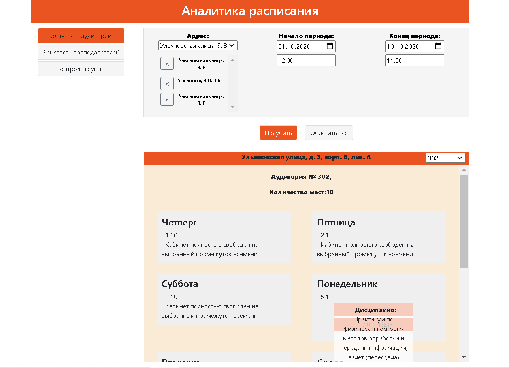
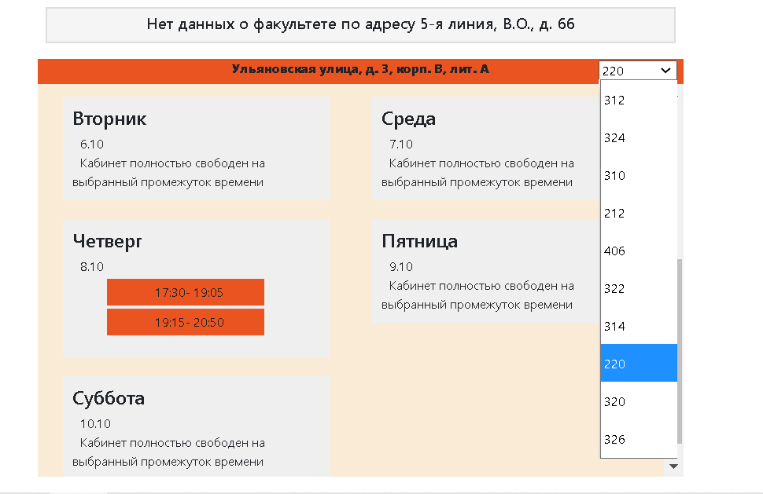
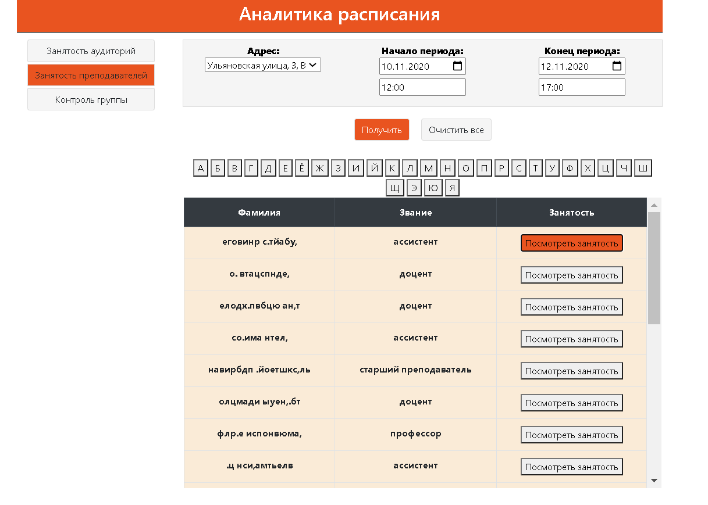
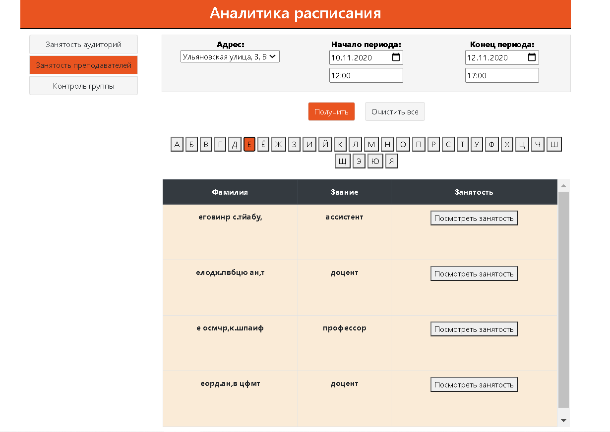
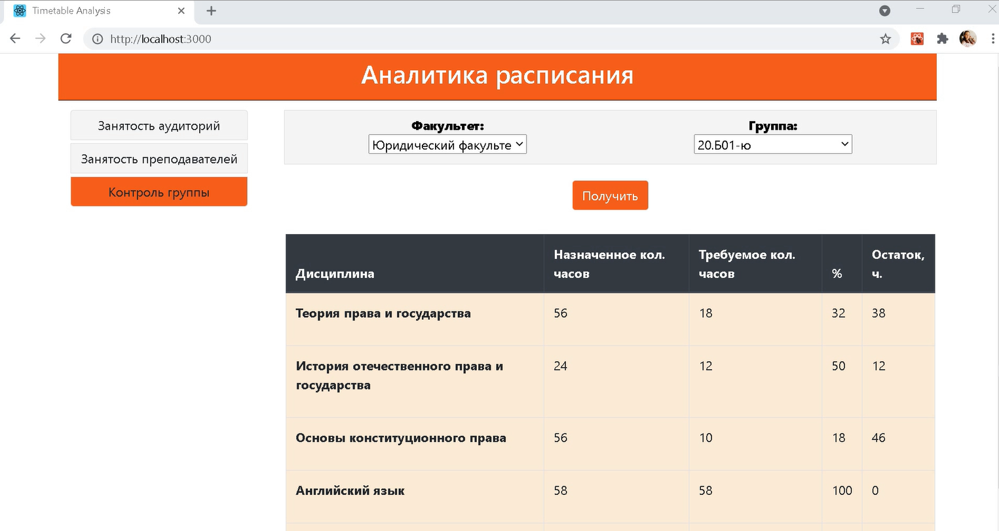
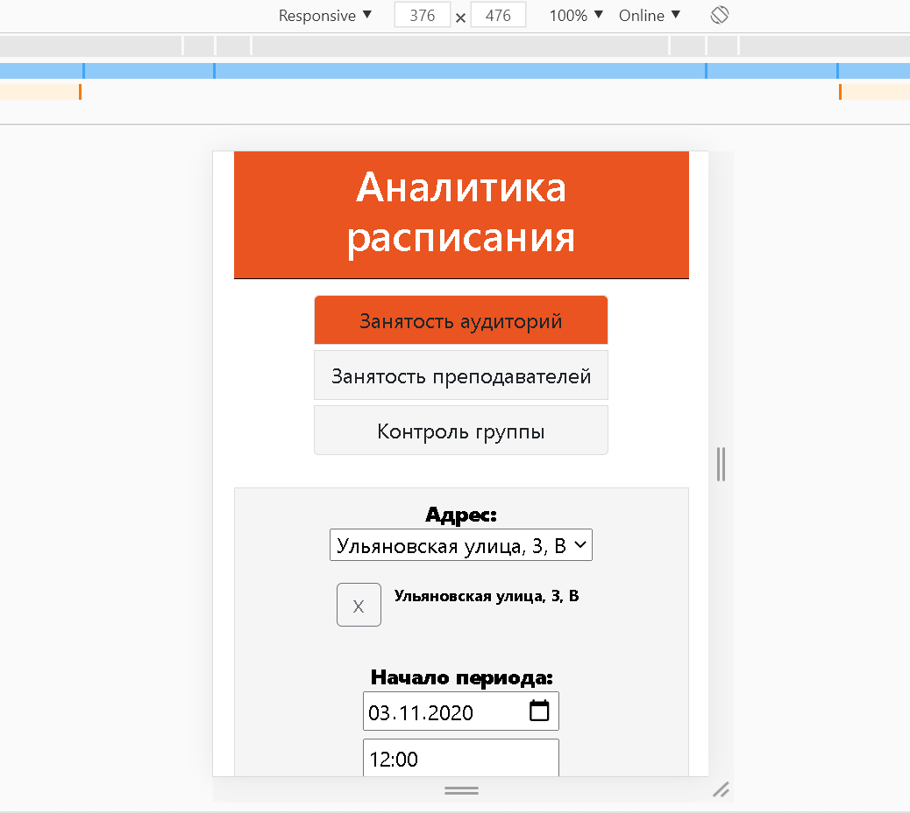

# TimeTableAnalytics
Практика "Анализ данных электронного расписания"

На основе данных электронного расписания и свободного ПО с открытым исходным кодом создать сервис кэширования данных и аналитическое Web приложение. Примеры аналитических срезов: занятость аудиторий, занятость преподавателей, занятость студентов, доступные аудитории по заданным критериям.
###Команда
__Team Leader__:  Тарасов Никита;  
__Frontend developer__: Щеникова Снежана;  
__Backend developer__: Берлина Анастасия;  
__Тестировщик__: Павлов Илья;  
__Помощник Team Leader__: Ли Цзин.

###Требования  
1.Проверка доступности аудиторий по времени;  
2.Проверка занятости преподавателей по времени;   
3.Контроль групп по выполнению учебного плана.
  
###Стек технологий  
__Frontend__: React + Redux;  
__Backend__: Java Spring Boot;  
__Data__: SSMS, Azure SQL Server;  
__Test__: Mockito, Junit, Enzyme.
###Результаты 
__Занятость аудиторий__

__Разделение по кабинетам__
  

__Занятость преподавателей__  
  

__Фильтрация по фамилии__

__Контроль группы__  

__Мобильная версия__

